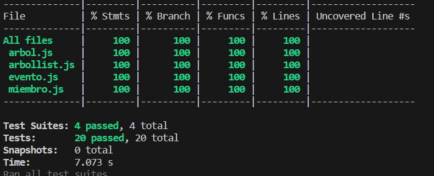

# Informe entrega 2

## Construcción
Para la construccion de la aplicación lo primero en que nos pusimos a resolver fue el funcionamiento y relacion de objetos que estarian presentes en base al funcionamiento de la aplicacion que esperamos. Para ello tuvimos una reunión de brrainstorming para entender que usisarios y clases eran impresindibles para el almacenamiento de datos. Luego de la reuniñon llegamos que las clases necesarias serían las de: Miembro, Arbol, Evento, a su vez de crear arrayList para almacenar y vincular cada uno de ellas con su informacion.

### Diseño de clases
**Clase Miembro:** La clase Miembro se compone por los siguientes atributos:
- Nombre
- Apellido
- Genero
- Lista de Eventos Cronologicos de la persona

Agregamos a su vez los metodos de:
- getEvento: para conseguir la lista de eventos cronologicos relacionada al miembro
- agregarEvento: agregar un nuevo evento
- getEdad: para calcular la edad en años en base a la fecha de nacimiento
- Ademas de los getters y setters

**Clase Arbol:** La clase Arbol se compone por los siguientes atributos:
- Su nombre para luego la busqueda e idenificación del arbol seleccionado
- La lista de Miembros que la confomran

Agregamos a su vez los metodos de:
- getArbol: para conseguir la lista de los miembros que conforman el arbol
- add: para agrregar un miembro al arbol
- Ademas de los getters y setters

**Clase Evento:** La clase Evento se compone por los siguientes atributos:
- Descripción
- Fecha de incidencia

**Listas creadas para las clases:** Por último creamos los arrayList de cada uno de las clases para el almacenamiento de datos:
- miembrolist
- arbollist

### Logica de la aplicacion
La aplicación la diseñamos con el concepto de que el usuarion que entre pueda crear los arboles genealógicos que desee y una vez creados los arboles la creacion de los miembros asociandolos al arbol correspondiente. El usuario al momento de crear añadir un miembro lo asocia al arbol al que pertenece.

Luego el usuario tiene la posibilidad de agregar Eventos a cualquier miembro que quiera y por último tiene la  visualización de información de vida de los miembros con la posibilidad de ver todos sus eventos cronologicos.
Tambièn agregamos la posibilidad de busqueda de miembros familiares dentro de los arboles genealógicos, por nombre o apellido.

### Sucesión de eventos
Respecto a como se fue dando la construcción, primero dedicamos al diseño de las clases para el uso de la aplicación, esta etapa fue de la que mas tiempo nos consumio ya que era necesaria para todo lo que nos esperaría luego con el diseño del html y lógica de la aplicación. 

Una vez con el esquema de clases implementado, armamos el HTML para la aplicación en la cual fue un proceso bastante mas ligero al anterior ya que teniamos un entendimiento mas profundo de lo que estabamos programando.
Luego, arrancamos con la logica e implementación de la funcionalidad de la aplicación con varios testeos para ver el uso de la misma.

Por último, empezamos con los test unitarios y validaciones con los estándares para que la aplicación cumpla con los requisitos.

## Interfaz de usuario
Para el diseño de la interfaz, tuvimos varias ideas de las cuales predomino una que fue la de ordenar las distintas funciones de la aplicación en distintas paginas controladas por un menu en el cual el usuario sepa que esta haciendo en la pantalla que esta parado.

### Diseño con navbar
El navbar es fundamental para la estructura de la aplicación ya que aqui el usuario entiende las distintas aplicaciones y aciones que puede ejercer en la misma. En la Navbar esta diseñado con las siguientes opciones:
- Agregar Arbol: creación de arbol genealogico.
- Lista de Arboles: visualizacion de todos los arboles creados.
- Argerar Miembro: pantalla para crear un nuevo miembro de un arbol.
- Agregar Evento Cronologico: el usuario puede agregar un evento al miembro que seleccione
- Ficha de Vida: en esta seccion el usuario puede seleccionar el Miembro al que quiere ver su ficha de vida. A su vez, tiene la opcion de ver en una lista todos los eventos cronologicos ordernados por su fecha, asociadas al miembro seleccionado.
- Busqueda y Filtrado: aqui el usuario podrá buscar a los miembros de los arboles por su nombre o apellido.

### Usabilidad para el usuario
Principalmente, el usuario puede navegar por las diferentes secciones y funcionalidades de la aplicación de manera libre usando las distintas funciones. También ,el uso del menu facilita a la experiencia del usuraio sin cargar de información al mismo.

## Codificación
Respecto a la estructura y organización de la aplicaction, lo separamos en 2 carpetas, Domain e Interfaz. En el Domain centralizamos todas las clases con sus respectivos metodos y en la carpeta de Interfaz centralizamos el HTML, CSS y el main en el cual corre la apliciónn. 

Para el diseño de la pagina utilizamos la librería Booststrap.

Respecto al main, importamos todas las clases e inicializamos las listas de miembrolist y arbollist para almacenar la informacion. A su vez, declaramos todos los botones de la aplicación como variables, para despues usarlas con los eventlistners, junto con la carga del DOM.

describiremos la codificación separando por las distintas secciones del menú de la aplicación:
### Agregar arbol
Con la accion del click del boton, creamos un nuevo objeto de Arbol y los creamos con el nombre ingresado en la pantalla. Si el nombre esta repetido salta un error y le pide al usuario cargarlo de nuevo ya que el arbol es existente.

A su vez, en la misma accion actualizamos la lista de arboles en la seccion "lista de Arboles" y en los inputs de lista desplegables.

### Agregar miembro
En esta seccion, creamos un nuevo objeto de Miembro y lo creamos con los datos ingresados y lo añadimos al arbol para que se vaya formando la familia.
Por último, actualizamos todas las listas desplegables con los nuevos miembros. 

### Agregar evento cronologico
En esta seccion, creamos un nuevo objeto con los datos ingresados por el usuario. Cabe destacar que al momento de la creación filtramos y buscamos al miembro que el usuario seleccionó para ya añadirle el evento dentro del objeto miembro. En el mismo momento ordenamos la lista de eventos por fecha.

### Ficha de vida
En esta seccion, con el click en el boton "Ver Ficha de Vida" se mostraran los datos del miembro seleccionado anteriormente por el usuario.

También, con la acción de click en el botón "Ver Cronología de Eventos" mostraremos la lista de eventos cronologicos relacionada con el miembro seleccionado ordenada por fecha de ocurrencia.

### Busqueda y filtrado
En esta sección, con el click en "Buscar" tomaremos los datos y recorremos la lista de arboles para identificar el arbol que se seleccionó y luego recorremos dentro del mismo arbol la lista de miembros que la conforman y evaluamos si coinciden con el nombre y apellido ingresado por el usuario.

Luego, mostramos todos los resultados (miembros) que tengan el mismo nombre, appelido o ambos que ingreso el usuario en la busqueda.

## Test unitario
Respecto al testing unitario realizamos pruebas a lo largo de todos las clases creadas cubriendo el 100% de los métodos en cada una de ellas. A su vez, realizamos test unitarios en los ArrayList creados de; miembros y arboles, en el 100% de sus métodos cubriendolos en su totalidad.

Para el testing unitario de cada clase y Arraylist creamos distintos archivos .test.js para el adecuado testeo del código.

A continuación adjuntamos una captura de los resultados de los mismos:

## Reflexión
### Reflexión Joaquín Cabrera
Personalmente, esta segunda etapa del obligatorio fue más exigente que la primera y donde mas aprendizage me llevo ya que fue aqui donde pusimos en practica todo lo que dimos en el año. A su vez, fue una instancia fundamental para reforzar todos los conocimientos que pusimos en práctica en la primera entrega.

Cabe destacar que en esta segunda entrega tuvimos una etapa grande de investigación y desarrollo importante que disfrute y aprendí mucho ya que muchas cosas que no sabia las pude aprender y entender y muchas otras en las que estaba olvidado pude refrescarlas como por ejemplo javascript.

Disfrute mucho esta entrega, es una instancia de gran aprendizaje y satisfacción, ver algo que arranca como idea e implementarla es gratificante.

### Reflexión Diego Parada

Durante el desarrollo de este proyecto, he experimentado un significativo avance en la aplicación práctica de los conceptos fundamentales de desarrollo y testing. Este proceso no solo ha fortalecido mi comprensión sobre la correcta utilización de dichas practicas, sino que también me ha proporcionado una visión integral de cómo abordar un proyecto desde sus fases iniciales hasta la implementación final.

Esta experiencia ha sido valiosa para consolidar los conocimientos adquiridos en clase y para aprender a aplicarlos de manera efectiva en entornos de proyectos reales. Me ha permitido apreciar la importancia de una perspectiva integral en el desarrollo de software, donde tanto el diseño y la implementación como las prácticas de testing son componentes cruciales para el éxito del proyecto. Este trabajo ha sido una oportunidad enriquecedora para crecer tanto técnica como colaborativamente en el mundo del desarrollo de software.